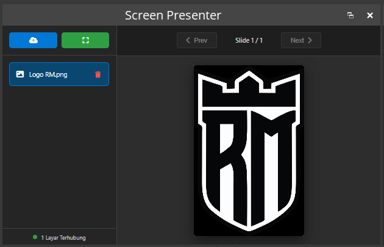

# 🎥 OBS Screen Presenter

**OBS Screen Presenter** adalah alat panel presentasi mandiri (*serverless*) yang didesain khusus untuk berjalan mulus di dalam ekosistem OBS Studio. Alat ini memungkinkan Anda untuk mengontrol file PDF atau gambar presentasi Anda melalui panel Dock OBS, dan secara *real-time* menampilkannya di layar streaming (*Browser Source*) Anda.

Tanpa perlu instalasi software tambahan, tanpa *server lokal*, dan sangat ringan!

---

## ✨ Fitur Unggulan

- 🚀 **100% Serverless & Ringan:** Tidak perlu menginstall Node.js, Python, atau XAMPP. Cukup buka file HTML dan langsung gunakan!
- ⚡ **Auto-Sync via WebRTC:** Dock dan Layar Presentasi terhubung secara otomatis melalui jalur internet super cepat (PeerJS) tanpa batas.
- 🎯 **Kualitas 1080p Dinamis:** PDF akan di-render secara otomatis ke resolusi HD (1080p) untuk menjaga ketajaman saat live streaming, namun tetap menghemat RAM & CPU komputer Anda.
- 💨 **Kompresi WebP:** Pengiriman gambar antar layar menggunakan kompresi WebP yang ukurannya 50% lebih kecil dan lebih ringan dari JPEG, sehingga transisi slide nyaris tanpa jeda.
- ✋ **Drag and Drop Pintar:** Mem-bypass keamanan ketat OBS! Anda dapat langsung menarik file (*drag & drop*) ke dalam panel Dock tanpa takut OBS akan memutar/merusak tampilan dock.
- 🛡️ **Anti White-Flash:** Dilengkapi dengan fitur *Double-Buffering Offscreen Canvas* untuk mencegah kilatan layar putih yang menyakitkan mata saat berpindah halaman PDF.

---

## 🛠️ Persyaratan Sistem

- **OBS Studio** (Versi 27+ ke atas direkomendasikan).
- **Koneksi Internet Aktif** *(Hanya digunakan sesaat sebagai server sinyal "pencari jalan" untuk menghubungkan Dock dan Source. Gambar Anda tidak diupload ke server public).*
- File presentasi dalam format **PDF, JPG, JPEG, PNG, atau WebP** (File PowerPoint `.ppt/.pptx` wajib di-Save As ke PDF terlebih dahulu).

---

## 🖼️ Tampilan Antarmuka

  
   
  <i>(Catatan: Letakkan foto screenshot panel admin Anda di folder ini dan beri nama file <code>admin-preview.png</code> agar gambar otomatis muncul di sini).</i>

---

## 📖 Cara Penggunaan (Panduan Setup di OBS)

### Langkah 1: Memasang Panel Kontrol (Dock Admin)
1. Buka **OBS Studio**.
2. Pada menu bar di atas, klik **Docks** > **Custom Browser Docks...**
3. Di kolom *Dock Name*, ketikkan nama: `Screen Presenter`
4. Di kolom *URL*, masukkan alamat lokasi asli file `index.html` yang Anda ekstrak ini di komputer Anda. *(Cara paling mudah: Buka file index.html di browser Google Chrome, lalu copy URL di atasnya, misalnya: `file:///C:/Users/Nama/Downloads/Dock%20Presenter/index.html`)*
5. Paste URL tersebut ke OBS, lalu klik **Apply**. 
6. Akan muncul panel kontrol baru. Silakan geser dan jepit (dock) panel tersebut ke sisi kiri, kanan, atau bawah tampilan antarmuka OBS Anda.

### Langkah 2: Memasang Layar Tampil (Browser Source)
1. Pada OBS Studio, pergi ke kotak **Sources** (Sumber).
2. Klik tombol `+` (Add) dan pilih **Browser**.
3. Beri nama sesuka Anda (misalnya: "Layar Presentasi") lalu klik OK.
4. Centang kotak **"Local file"**.
5. Klik tombol **Browse**, lalu cari dan pilih file `view.html`.
6. Atur *Width* ke `1920` dan *Height* ke `1080`.
7. Klik **OK**. Atur letak dan ukuran layar presentasi tersebut di dalam kanvas utama OBS Anda.

### Langkah 3: Mulai Presentasi!
1. Pastikan komputer terhubung ke internet.
2. Di Panel Dock **Screen Presenter** yang sudah terpasang, perhatikan indikator di pojok kiri bawah. Jika sudah terhubung, ia akan berubah menjadi hijau bertuliskan **"1 Layar Terhubung"**.
3. Klik ikon awan (Upload) atau cukup *Drag & Drop* file presentasi PDF/Gambar Anda ke dalam panel.
4. Klik materi yang baru saja di-upload pada daftar menu.
5. Gunakan tombol **Prev** dan **Next** (atau tekan tombol panah kiri/kanan di *Keyboard* Anda) untuk mengganti slide. 
6. Layar penonton di OBS akan ikut berubah secara mulus dan instan!

---

## ❓ Kendala Umum (FAQ)

**Q: Indikator koneksi di Dock tertulis "Sinyal Offline" atau berwarna merah?**
A: Hal ini wajar jika internet Anda sempat terputus. Sistem biasanya akan mencoba menyambung ulang sendiri (*Auto-Reconnect*). Namun jika dirasa lama, Anda cukup **Klik Kanan > Refresh** pada area kosong di dalam Panel Dock OBS Anda. 

**Q: Saat pindah slide PDF, kenapa proses rendernya agak lambat jika halamannya banyak?**
A: Modul PDF kami merender halaman secara dinamis per-*click* untuk menghemat memori komputer Anda. Jangan menekan tombol *Next* terlalu agresif berkali-kali secara cepat untuk menghindari penumpukan tugas render.

**Q: Bisakah file PPT/PPTX Microsoft PowerPoint langsung dimasukkan?**
A: Tidak bisa. Fitur browser tidak memiliki *engine* Microsoft Office. Harap lakukan **File > Save As / Export** presentasi PPT Anda menjadi format **PDF**. File PDF akan bisa langsung diupload dan dibaca oleh plugin ini dengan sempurna.

---
*Dibuat khusus untuk meningkatkan kemudahan presentasi live streaming yang elegan, mandiri, dan profesional.*
